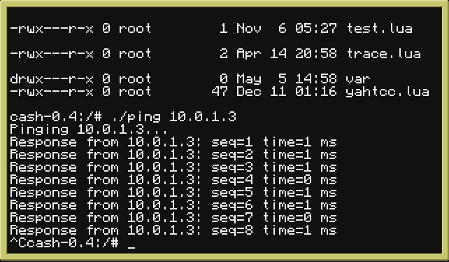
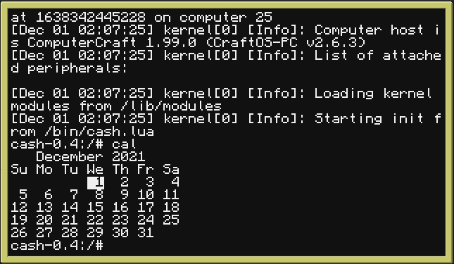

# Demos
This page lists a number of public demonstrations of the features of Phoenix in development.

## Screenshots

### APT installing packages from Ubuntu PPA


### Phoenix debugger demo


### CCKit2 element test


### YellowBox virtual machines for CraftOS


### FTP mounting over network


### Installation program


### libcraftos running CraftOS Lua REPL


### Early startmgr starting up the system


### screenfetch on Phoenix


### dpkg-lua package manager on Phoenix


### pxboot boot loader


### libsystem.graphics demo


Code:
```lua
local terminal = require "system.terminal"
local graphics = require "system.graphics"

local term = terminal.opengfx()
graphics.drawFilledTriangle(term, 10, 10, 40, 10, 25, 40, terminal.colors.red)
graphics.drawFilledTriangle(term, 41, 10, 26, 40, 56, 40, terminal.colors.blue)
graphics.drawFilledTriangle(term, 80, 20, 140, 50, 100, 80, terminal.colors.green)
graphics.drawCircle(term, 50, 120, 50, 30, terminal.colors.orange)
```

### Logging module demo


### Internet & socket demo


### Ping program


### Demonstration of ANSI support


### Lua REPL with multiline support


### Multiple CraftOS programs ported to Phoenix


### Test of hardware API & monitor support


### Event viewer program


### Demo of command output redirection


### POSIX `cal` program


## Videos

### GNU nano on Phoenix
<video width=620 height=350 controls>
<source src="demos/nano.mp4" type="video/mp4">
</video>

### Preemption demo
<video width=620 height=350 controls>
<source src="demos/preemption.mp4" type="video/mp4">
</video>
